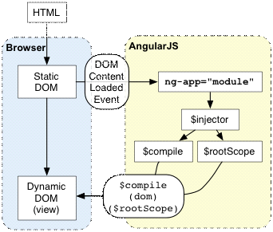
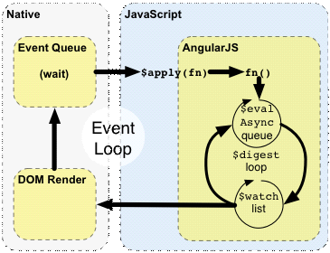
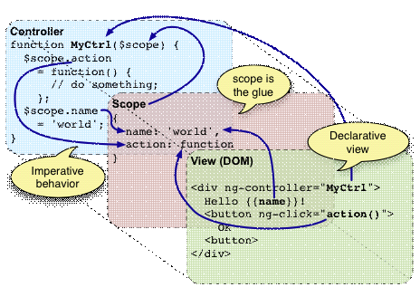
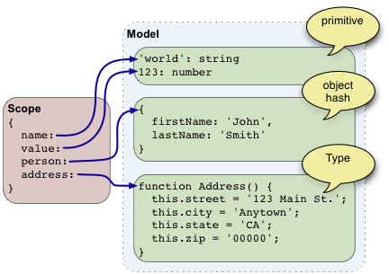
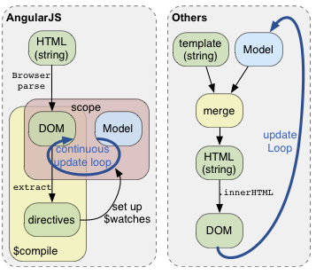

title: angularjs
author:
  name: 牟少峰
  url: https://github.com/mushaofeng/angularJs
output: angularjs.html
theme: sudodoki/reveal-cleaver-theme
--

# Angularjs
由Google创建的一种JS框架，使用它可以扩展应用程序中的HTML词汇，从而在web应用程序中使用HTML声明动态内容。

--

##前端框架的演化

* jQuery 		(链式调用)
* Backbone 		(MVC开发模式)
* angularjs		(数据双向绑定)

--

##数据双向绑定

* [Simple Demo](file:///Users/msf/LAMP/webserver/ng/index.html)
* [form Demo](file:///Users/msf/LAMP/webserver/ng/form.html)

-- 
## AngularJs 解析

--

##启动

[参考](http://www.cnblogs.com/lcllao/archive/2012/09/07/2671227.html)

--

1. 浏览器加载HTML，将HTML标签转换为DOM对象；

2. 浏览器加载angular.js的脚本；

3. Angular等待DOMContentLoaded事件；

4. Angular寻找ng-app这个用于指定应用边界范围的directive；

5. 如果ng-app有指定module（也许是ng-app=”SomeApp”），将被用作配置$injector；

6. $injector用于创建$compile服务（service）以及$rootScope；

7. $compile服务用作“编译”（有点像遍历，然后做一点神秘的事情）DOM，并将其与对应的$rootScope连接。

8. ng-init 这个directive在对应的scope中创建name属性并对其赋予”Kitty”值；

9. 将“{{name}}”的值插入(interpolates)到表达式中，最终显示”Hello Kitty!”。

[Simple Demo](file:///Users/msf/LAMP/webserver/ng/index.html)

--
## Runtime

[cutdown](file:///Users/msf/LAMP/webserver/ng/cutdown.html)

[参考](http://www.cnblogs.com/lcllao/archive/2012/09/07/2671227.html)

--

* 将Javascript分割成传统的和Angular的执行上下文（execution context）。只要是在Angular execution context 里面执行的操作，都拥有angular data-binding、异常处理（exception handling）、属性监视（property watching）等能力。我们可以通过在javascript使用$apply()，进入Angular execution context。但要记住一点，在大多数（angular的）地方（如controllers、services），处理事件的directive会为你调用$apply。

--

## 相关概念
* scope
* controller
* Model
* View
* Directives
* Injector

--
## scope

scope的是负责检测model的变化，并作为表达式的执行上下文

[demo](file:///Users/msf/LAMP/webserver/ng/scope.html)

--
##Controller

它的职责是构建model，并通过回调函数，将其（model）推送到view中。

Controller与view分离是很重.

--
##Model

为了将model写入到视图中，model必须被scope所引用。

--
##View

Angular模版的不同之处，在于它是基于DOM的而不是基于字符串的。
浏览器把HTML转换为DOM，然后DOM成为了compiler（angular的模版引擎）的输入。
Compiler查找directives，依次在model中设置watches。

* [directive Demo](file:///Users/msf/LAMP/webserver/ng/index.html)

--

##Directives(指示器)

将其名称放在属性、标签名、class名里面都可以触发该directive

Directive允许你以声明的方式扩展HTML的标签。

TODO  指示器 

[参考](http://www.cnblogs.com/lcllao/archive/2012/09/09/2677190.html)
--
##Injector(服务定位器 注入器)

[参考](file:///Users/msf/LAMP/webserver/ng/Injector.html)

--

##优点

1. 模板功能强大丰富，并且是声明式的，自带了丰富的Angular指令；
2. 是一个比较完善的前端MVC框架，包含模板，数据双向绑定，路由，模块化，服务，过滤器，依赖注入等所有功能；
3. Angular 能够将关注点分离的非常彻底。服务层（Ajax 请求）- 业务层（Controller）- 展现层（HTML 模板）- 交互层（animation）。
4. 双向绑定、依赖注入、scope、指示器

--

##缺点
1. ngView只能有一个，不能嵌套多个视图。
2. 对于特别复杂的应用场景，貌似性能有点问题.
3. 从1.0.X升级到1.2.X，貌似有比较大的调整，没有完美兼容低版本.
4. ng提倡在控制器里面不要有操作DOM的代码，对于一些jQuery 插件的使用，如果想不破坏代码的整洁性，需要写一些directive去封装插件
5. Angular 太笨重了，没有让用户选择一个轻量级的版本
6. 迁移到Angular成本较高，大数据量页面不适合。

--

##相关资料

[angularjs learning](https://github.com/jmcunningham/AngularJS-Learning/blob/master/ZH-CN.md)

[入门教程](http://www.ituring.com.cn/article/13471)

* [何时应该使用Directive、Controller、Service](http://damoqiongqiu.iteye.com/blog/1971204)
* [directive定义对象说明](http://www.cnblogs.com/lcllao/archive/2012/09/09/2677190.html)

* [练习项目 angular-phonecat](https://github.com/angular/angular-phonecat)
--

##TODO

1. AngularJS 框架应用
2. Directives详细用法

--

